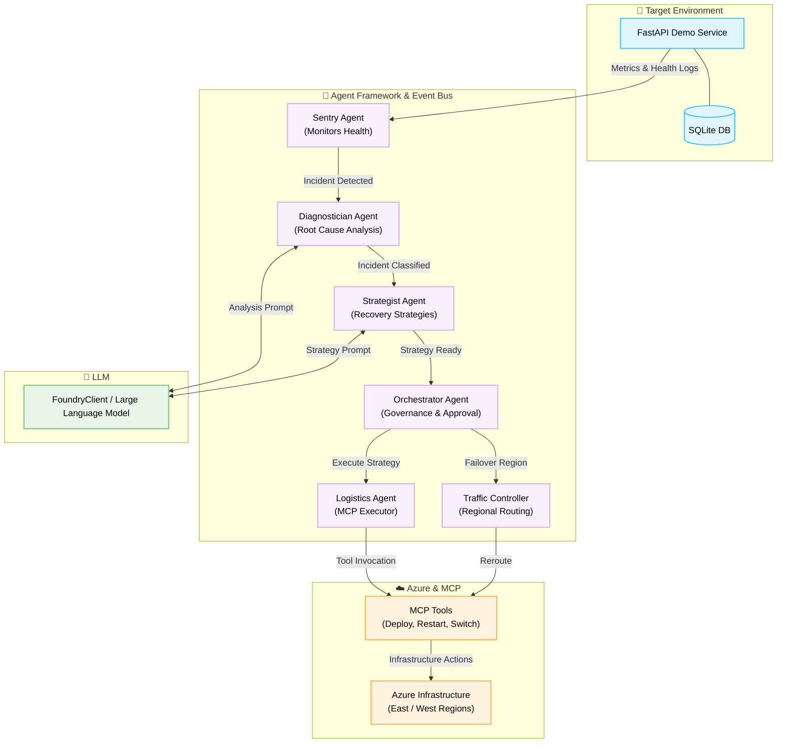

# Project Overwatch

**Project Overwatch** is a highly autonomous, multi-agent IT operations swarm. It is designed to intelligently monitor, diagnose, strategize, and resolve infrastructure and application incidents in real-time. Built upon a microservices architecture and advanced Agentic AI paradigms, Overwatch orchestrates automated failovers, service lifecycle management, and Azure infrastructure manipulation through the Model Context Protocol (MCP).

---

## 🏗️ Architecture Diagram



---

## 🤖 The Overwatch Agent Swarm

The system's operational intelligence is distributed across specialized roles, communicating asynchronously via an internal event bus:

*   **Sentry Agent**: The monitoring vanguard. It continuously polls the target application's health and telemetry endpoints (`/health` and `/metrics`). Upon detecting anomalies—such as elevated latency, increased error rates, or service disruption—it registers an `Incident` and alerts the overall system.
*   **Diagnostician Agent**: The analytical core. It ingests incident metrics and leverages an LLM (via `FoundryClient`) to perform root cause analysis, assign structural classifications (e.g., database failure, network outage), and recommend immediate investigatory or remedial actions.
*   **Strategist Agent**: The strategic planner. It synthesizes the Diagnostician's assessment to formulate a concrete, executable recovery strategy (e.g., `failover_region`, `restart_service`, `scale_service`) using AI inference.
*   **Agent Orchestrator**: The governance layer. It evaluates proposed recovery strategies alongside their AI-generated confidence scores. High-confidence strategies (>85%) are auto-approved for execution, while lower-confidence plans trigger requests for human-in-the-loop intervention.
*   **Logistics Agent**: The execution arm. It is responsible for translating approved recovery strategies into tangible, infrastructure-level actions using specific MCP tools.
*   **Traffic Controller Agent**: The network specialist. It is dedicated to managing traffic routing and executing regional failovers when severe, multi-region degradation is detected.

---

## 🛠️ Model Context Protocol (MCP) Integration

The agent swarm interacts with the underlying infrastructure using specific MCP scripts located in `mcp/tools/`. These tools provide a standardized interface for complex operational tasks:

*   `deploy_container.py`: Scales services or pushes container updates.
*   `restart_service.py`: Executes lifecycle restarts for Docker or Azure container apps.
*   `switch_traffic.py`: Reroutes traffic between Azure primary (East) and secondary (West) regions via the Azure CLI.
*   `azure_mcp_server.py`: The integration server responsible for handling tool dispatching and execution against Azure resources.

---

## 🖥️ The Demo Service Environment

A lightweight, fully functional environment designed specifically to be monitored, stressed, and auto-healed by the agent swarm.

*   **Backend (FastAPI, Python)**: Located in `mini_app/backend/`. It features a SQLite database, user CRUD routes (`/api/users`), and critical monitoring endpoints (`/health`, `/metrics`, `/status`).
*   **Chaos Engineering Capabilities**: Exposes secure administrative endpoints (`/admin/degrade`, `/admin/outage`, `/admin/recover`) to artificially inject latency and errors, facilitating robust testing of the agents' response times.
*   **Frontend (HTML/JS)**: Served statically by FastAPI, providing a visual interface for the demo application.

---

## ☁️ Infrastructure & Deployment

*   **Local Containerization**: Managed via `docker-compose.yml`, deploying the demo service alongside the agent swarm in isolated, yet connected, containers.
*   **Azure Infrastructure (Terraform)**: Located in `infra/azure/`. It provisions an Azure Resource Group, Container Registry, Log Analytics Workspace, and dual-region (East/West) Container App Environments to support the agents' multi-region failover automation.

---

## 🚀 Getting Started

1. **Configure Environment:** Set up your `.env` variables, including required Azure credentials and OpenAI/Foundry API keys.
2. **Install Dependencies:** 
   ```bash
   pip install -r requirements.txt
   ```
3. **Initialize Environment:** 
   ```bash
   docker-compose up --build
   ```
4. **Launch Overwatch:** The primary system entry point is `scripts/start_overwatch.py`. Execute this script to initiate agent registration, observe the boot sequence, and trigger manual incident simulations.
